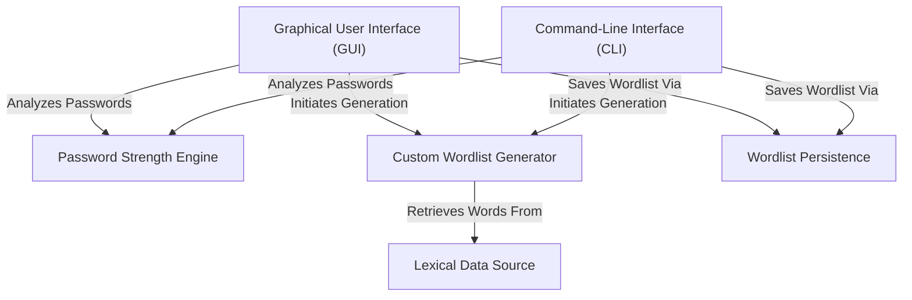
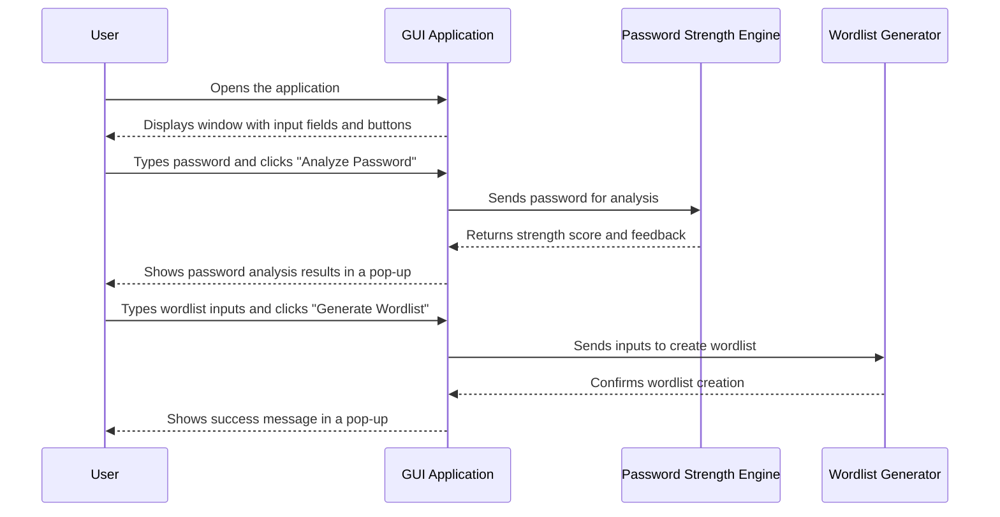
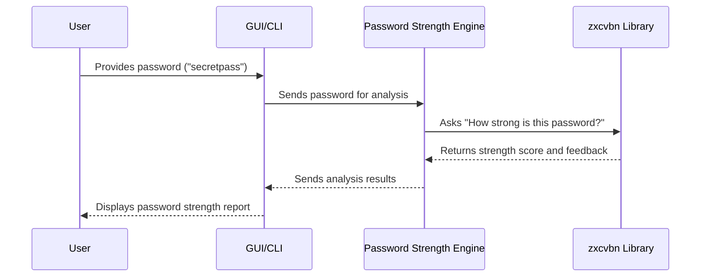
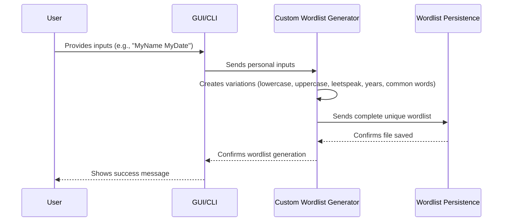
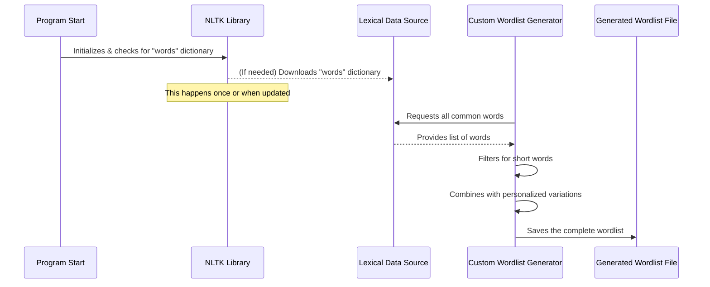

# Tutorial: Password_strength-analyzer_project

This project is a helpful tool that lets you **check how strong your passwords are** and *create custom lists of potential passwords* for testing. It evaluates passwords using a smart engine to give you a security score and feedback. Additionally, you can input personal details like names or dates, and it will generate a unique wordlist by intelligently varying these inputs and adding common words, which can then be saved for future use.


## Visual Overview



## Chapters

1. [Graphical User Interface (GUI)
](01_graphical_user_interface__gui__.md)
2. [Command-Line Interface (CLI)
](02_command_line_interface__cli__.md)
3. [Password Strength Engine
](03_password_strength_engine_.md)
4. [Custom Wordlist Generator
](04_custom_wordlist_generator_.md)
5. [Lexical Data Source
](05_lexical_data_source_.md)
6. [Wordlist Persistence
](06_wordlist_persistence_.md)

---

# Chapter 1: Graphical User Interface (GUI)

Welcome to the **Password Strength Analyzer** project! In this first chapter, we're going to explore something you use every single day: the **Graphical User Interface (GUI)**.

### Why Do We Need a GUI?

Imagine you want to use a tool to check how strong your password is, or to create a special list of words (a "wordlist") to help you make better passwords. How would you interact with this tool?

If you had to type complex commands into a black screen (like a hacker in a movie!), it might be confusing and difficult to remember everything. This is where a **Graphical User Interface (GUI)** comes in!

Think of a GUI like the dashboard of a car:
*   You don't need to remember complex engine codes to start the car; you just turn a key or push a button.
*   You don't need to be a mechanic to see how fast you're going; there's a speedometer right in front of you.

The GUI for our password analyzer is exactly like that car dashboard. It gives you a visual way to interact with the program. Instead of typing commands, you'll see windows, text boxes where you can type your password, and buttons you can click to get results. It makes the program super easy and friendly to use!

**Problem Solved:** The GUI solves the problem of making complex computer programs easy for anyone to use, without needing to learn special commands. It's all about making the program "user-friendly."

Our central use case is simple: **You want to easily check your password's strength and generate a personalized wordlist just by clicking and typing.** The GUI helps you do exactly that!

### Key GUI Elements

A GUI is built from many different visual parts. For our password analyzer, the most important ones are:

1.  **Windows**: The main box that pops up on your screen when you open the program. It holds everything else.
2.  **Labels**: Simple text that gives you instructions or information, like "Enter Password:".
3.  **Text Boxes (Entry Fields)**: Places where you can type information, such as your password or words for your custom wordlist.
4.  **Buttons**: Clickable areas that perform an action, like "Analyze Password" or "Generate Wordlist".

### How to Use the GUI to Analyze Passwords and Generate Wordlists

When you run our `password_gui.py` program, you'll see a window pop up on your screen. This is our GUI!

You'll see:
*   A "label" telling you "Enter Password:".
*   A "text box" where you can type your password (the text might be hidden for privacy, shown as `***`).
*   A "button" labeled "Analyze Password".
*   Another "label" asking for inputs for the wordlist.
*   Another "text box" for those inputs.
*   A "button" labeled "Generate Wordlist".

#### Example Interaction:

1.  **To Analyze a Password:**
    *   You would **type your password** into the first text box.
    *   Then, you would **click the "Analyze Password" button**.
    *   A small pop-up message will appear showing your password's strength.

    Here's a simplified look at the part of the code that sets up the password input:

    ```python
    # This creates a text label for the user
    tk.Label(root, text="Enter Password:").pack()

    # This creates the box where you type your password
    entry_password = tk.Entry(root, show='*', width=30)
    entry_password.pack()
    ```
    *Explanation*: The first line puts the words "Enter Password:" on the window. The second line creates the actual typing box, `entry_password`, and `show='*'` means anything you type will show as asterisks (like `***`) to keep your password private. `pack()` just helps arrange things nicely on the window.

    And this is the button you click:

    ```python
    # This creates the button you click to check the password
    tk.Button(root, text="Analyze Password", command=analyze_password_gui).pack(pady=5)
    ```
    *Explanation*: This line creates the "Analyze Password" button. When you click it, the program knows to run a special function called `analyze_password_gui` (we'll learn more about what this function does in [Password Strength Engine](03_password_strength_engine_.md)).

2.  **To Generate a Wordlist:**
    *   You would **type some personal information** (like your name, a pet's name, or a special date) into the second text box, separated by spaces.
    *   Then, you would **click the "Generate Wordlist" button**.
    *   A message will pop up confirming that a file named `custom_wordlist_gui.txt` has been created with your personalized words!

    Here's the simplified code for the wordlist input and button:

    ```python
    # Label for wordlist inputs
    tk.Label(root, text="Enter Inputs (name, date, pet) separated by space:").pack()

    # Text box for wordlist inputs
    entry_inputs = tk.Entry(root, width=50)
    entry_inputs.pack()

    # Button to generate the wordlist
    tk.Button(root, text="Generate Wordlist", command=generate_wordlist_gui).pack(pady=5)
    ```
    *Explanation*: Similar to the password section, these lines create the label and the text box for your wordlist inputs (`entry_inputs`). The button then calls the `generate_wordlist_gui` function when clicked. (You'll learn more about wordlists in [Custom Wordlist Generator](04_custom_wordlist_generator_.md)).

### How the GUI Works (Under the Hood)

Let's peek behind the curtain to see what happens when you use the GUI.

When you click a button or type something, the GUI acts like a messenger. It takes your action and tells the rest of the program what you want to do.

Here's a simple step-by-step idea of the process:

1.  **You** (the User) see the GUI window on your screen.
2.  **You** type your password into the password box.
3.  **You** click the "Analyze Password" button.
4.  The **GUI Application** notices the button click.
5.  The **GUI Application** collects the password you typed from its text box.
6.  The **GUI Application** then sends this password to the part of the program that actually checks password strength (the [Password Strength Engine](03_password_strength_engine_.md)).
7.  The **Password Strength Engine** does its calculations and sends the results back to the **GUI Application**.
8.  Finally, the **GUI Application** shows these results to **You** in a friendly pop-up message.

We can visualize this interaction:



#### Inside the Code (`password_gui.py`)

The magic behind our GUI is a Python library called `tkinter`. It helps us create windows, buttons, and text boxes easily.

First, we tell Python we want to use `tkinter`:

```python
import tkinter as tk
from tkinter import messagebox
# ... other imports for password strength and wordlist generation ...
```
*Explanation*: `import tkinter as tk` brings in the `tkinter` tools, giving them a shorter name `tk` so it's easier to type. `from tkinter import messagebox` allows us to show those friendly pop-up messages.

Next, we create the main window for our application:

```python
# Create the main window of our GUI application
root = tk.Tk()
root.title("Password Strength Analyzer")

# This line keeps the window open and listening for clicks/typing
root.mainloop()
```
*Explanation*: `root = tk.Tk()` creates the main window that appears on your screen. `root.title(...)` sets the title you see at the very top of the window. The crucial line `root.mainloop()` starts the GUI and keeps it running, waiting for you to type or click things. Without it, the window would just appear and disappear instantly!

All the labels, text boxes, and buttons (like the ones we saw above) are added *between* `root = tk.Tk()` and `root.mainloop()`, so they appear inside our main window.

### Conclusion

In this chapter, we learned that a **Graphical User Interface (GUI)** is the visual, easy-to-use part of a program. It helps you interact with the software using windows, text boxes, and buttons, just like a car's dashboard. We saw how the GUI allows us to easily analyze passwords and generate custom wordlists without needing to remember complex commands.

We also got a first look at how the GUI works by using a library called `tkinter` to create these visual elements and connect them to actions. The GUI is what makes our Password Strength Analyzer approachable for everyone!

Next, we'll explore another way to interact with programs, one that doesn't use a visual interface: the [Command-Line Interface (CLI)](02_command_line_interface__cli__.md).

---

 Chapter 2: Command-Line Interface (CLI)

Welcome back! In our last chapter, [Graphical User Interface (GUI)](01_graphical_user_interface__gui__.md), we explored how a friendly visual interface, with its buttons and text boxes, makes programs easy to use for everyone. It's like having a car dashboard where you just click and see things happen.

But what if you don't always need a dashboard? What if you want to tell the car exactly what to do using specific voice commands, perhaps even chaining them together for a longer journey without touching the wheel? This is where the **Command-Line Interface (CLI)** comes in!

### Why Do We Need a CLI?

Imagine you're a super-efficient chef. Sometimes you want to use a fancy, visual kitchen appliance (our GUI) with screens and buttons. But other times, you just want to quickly chop onions without all the fuss, perhaps even telling a smart assistant: "Chop onions, then dice tomatoes, then mince garlic!" This quick, direct approach is what the **Command-Line Interface (CLI)** offers.

The CLI provides an alternative way to interact with our password analyzer. Instead of clicking buttons, you'll type text commands directly into a special program called a "terminal." It's like talking to a smart assistant by giving specific voice commands, offering a more direct and often scriptable way to use the program.

**Problem Solved:** The CLI solves the problem of needing a fast, direct, and repeatable way to interact with a program, especially for tasks that might be automated or for users who prefer precise text-based control.

Our central use case for the CLI is simple: **You want to quickly check a password's strength or generate a personalized wordlist directly from your computer's terminal, often as part of a larger script or for power users who prefer keyboard input.**

### What is a Command-Line Interface (CLI)?

A CLI is simply a way to interact with a computer program by typing text commands. It's often associated with a "black screen with white text" that you might see in movies, but it's a powerful and efficient way to work.

Think of it like giving instructions to a robot by speaking:
*   Instead of pointing and clicking, you *tell* the robot: "Go forward 5 steps."
*   If you want it to also turn, you might add: "Then turn right."

Here are the key elements of a CLI:

1.  **Terminal (or Command Prompt/Shell)**: This is the application on your computer where you type commands. On Windows, it's often called "Command Prompt" or "PowerShell." On macOS and Linux, it's usually just called "Terminal."
2.  **Commands**: These are the main instructions you give to the computer. For our project, the command will be `python password_strenght.py` (which tells your computer to run our Python script).
3.  **Arguments (or Flags)**: These are extra pieces of information you give along with a command to tell the program *how* to do something or *what* to act upon. They usually start with one or two hyphens (like `-p` or `--password`).

### How to Use the CLI to Analyze Passwords and Generate Wordlists

To use our password analyzer with the CLI, you'll open your Terminal application and type a command.

Remember, our `password_strenght.py` program (which contains the code for both analyzing passwords and generating wordlists) expects *both* a password to analyze *and* inputs for the wordlist generation. So, even if you only care about one part, you'll need to provide something for both.

Let's look at how to run our script from the command line:

```bash
# This is a general example of how you'd run a Python script
python your_script_name.py
```
*Explanation*: `python` tells your computer to use the Python program to run a script. `your_script_name.py` is the name of the script you want to run.

For our project, the script is named `password_strenght.py`.

#### Example Interaction 1: Analyzing a Password

Let's say you want to check the strength of "MySuperSecretPassword123!". Since our script also requires wordlist inputs, we'll provide some dummy ones for `john doe`.

```bash
# Type this command in your Terminal:
python password_strenght.py --password MySuperSecretPassword123! --inputs "john doe"
```
*Explanation*:
*   `python password_strenght.py`: This runs our main program.
*   `--password MySuperSecretPassword123!`: This is an argument that tells the program the password you want to analyze. `--password` is the "flag," and `MySuperSecretPassword123!` is the "value."
*   `--inputs "john doe"`: This is another argument providing inputs for the wordlist generation. We're using `"john doe"` as dummy input since our script requires it.

After running this command, you'll see output directly in your Terminal, something like this:

```
Password Strength Score: 3/4
Estimated Guesses: 1234567890
Feedback: No warnings.

Wordlist exported successfully to: custom_wordlist.txt
```
*Explanation*: The program tells you how strong the password is and also confirms that a wordlist was created (because the script always does both!).

#### Example Interaction 2: Generating a Wordlist

Now, let's say your main goal is to generate a custom wordlist using your dog's name "Fluffy" and your favorite year "2023". You still need to provide a dummy password, for example, "dummy".

```bash
# Type this command in your Terminal:
python password_strenght.py --inputs "Fluffy 2023" --password dummy --output my_special_wordlist.txt
```
*Explanation*:
*   `python password_strenght.py`: Runs the program.
*   `--inputs "Fluffy 2023"`: Provides the core words for your custom wordlist.
*   `--password dummy`: A dummy password, as the script requires one.
*   `--output my_special_wordlist.txt`: This is an *optional* argument to tell the program to save the wordlist to a specific file name (`my_special_wordlist.txt`) instead of the default `custom_wordlist.txt`.

The output in your Terminal will confirm the wordlist creation:

```
Password Strength Score: 0/4
Estimated Guesses: 1
Feedback: This is a common password.

Wordlist exported successfully to: my_special_wordlist.txt
```
*Explanation*: You'll see the password analysis for "dummy" (which is very weak!), followed by the confirmation of your wordlist export. If you then look in the same folder as your `password_strenght.py` file, you'll find `my_special_wordlist.txt`.

### CLI vs. GUI: A Quick Comparison

Both GUI and CLI allow you to use a program, but they do it in different ways:

| Feature          | Graphical User Interface (GUI)                          | Command-Line Interface (CLI)                                  |
| :--------------- | :------------------------------------------------------ | :------------------------------------------------------------ |
| **Interaction**  | Clicking buttons, typing into text boxes                | Typing text commands and arguments                            |
| **Visuals**      | Windows, icons, menus, pop-ups                          | Text-based output directly in the terminal                    |
| **Ease for New** | Very easy for beginners, intuitive                      | Might seem intimidating at first, requires remembering commands |
| **Speed**        | Slower for repetitive tasks (lots of clicking)          | Very fast for repetitive tasks, can be automated              |
| **Automation**   | Hard to automate                                        | Easy to automate (write scripts to run commands)              |
| **Use Case**     | Everyday users, quick checks with visual feedback       | Power users, developers, automation, server environments      |

### How the CLI Works (Under the Hood)

Let's peek behind the curtain to see what happens when you use the CLI.

When you type a command into your terminal, it's not magic! Your computer and our Python script work together to understand your instructions.

Here's a simple step-by-step idea of the process:

1.  **You** (the User) open your Terminal and type a command like `python password_strenght.py --password secret --inputs name`.
2.  The **Terminal** sends this entire line of text to the Python program.
3.  The **Python Script** (specifically, a part of it called `argparse`) reads the command and figures out: "Ah, the user wants to run `password_strenght.py`, and they provided a password (`secret`) and some inputs (`name`)!"
4.  The **Python Script** then uses these pieces of information to call the functions that perform the [Password Strength Engine](03_password_strength_engine_.md) analysis and [Custom Wordlist Generator](04_custom_wordlist_generator_.md) tasks.
5.  The **Python Script** takes the results from these tasks and prints them directly back to your **Terminal**.
6.  Finally, **You** see the results displayed as text.

We can visualize this interaction:

```mermaid
sequenceDiagram
    participant User
    participant Terminal
    participant Python Script (password_strenght.py)
    participant Argparse (inside Script)
    participant Core Functions (Engine, Generator)

    User->>Terminal: Types "python password_strenght.py --password P1 --inputs I1"
    Terminal->>Python Script (password_strenght.py): Starts the script with arguments
    Python Script (password_strenght.py)->>Argparse (inside Script): Passes raw arguments to understand
    Argparse (inside Script)-->>Python Script (password_strenght.py): Provides organized arguments (e.g., args.password, args.inputs)
    Python Script (password_strenght.py)->>Core Functions (Engine, Generator): Calls functions using organized arguments
    Core Functions (Engine, Generator)-->>Python Script (password_strenght.py): Returns results and confirms file operations
    Python Script (password_strenght.py)-->>Terminal: Prints results and messages
    Terminal-->>User: Displays output text
```

#### Inside the Code (`password_strenght.py`)

The magic behind understanding command-line arguments in Python is a built-in tool called `argparse`. It helps us define what arguments our script expects and then easily get the values that the user typed.

First, we tell Python we want to use `argparse`:

```python
# File: Password Strength Analyzer with Custom Wordlist Generator/password_strenght.py
import argparse
# ... other imports ...
```
*Explanation*: `import argparse` brings in the tools needed to handle command-line arguments.

Next, inside our `main` function, we create something called a `parser`. This parser is like a rulebook for `argparse` to understand what arguments are allowed:

```python
# File: Password Strength Analyzer with Custom Wordlist Generator/password_strenght.py
def main():
    # Create a parser that understands command-line arguments
    parser = argparse.ArgumentParser(description="Password Strength Analyzer & Custom Wordlist Generator")
    # ... more code to add specific arguments ...
```
*Explanation*: `argparse.ArgumentParser(...)` creates our argument "rulebook." The `description` is a helpful text that users see if they type `python password_strenght.py --help`.

Then, we add the specific arguments our script expects, like `--password` and `--inputs`:

```python
# File: Password Strength Analyzer with Custom Wordlist Generator/password_strenght.py
def main():
    parser = argparse.ArgumentParser(description="Password Strength Analyzer & Custom Wordlist Generator")
    # Add an argument for the password (short form -p, long form --password)
    parser.add_argument('-p', '--password', type=str, required=True, help='Password to analyze')
    # Add an argument for custom inputs (nargs='+' means it can take one or more words)
    parser.add_argument('-i', '--inputs', nargs='+', required=True, help='Custom user inputs (name, pet, date)')
    # Add an optional argument for the output filename
    parser.add_argument('-o', '--output', type=str, default='custom_wordlist.txt', help='Output wordlist filename')
    # ... more code to get the parsed arguments ...
```
*Explanation*:
*   `parser.add_argument(...)`: This line defines one specific argument.
*   `-p`, `--password`: These are the short and long ways to type the argument in the terminal.
*   `type=str`: Means the value for this argument should be text (a string).
*   `required=True`: Means the user *must* provide this argument when running the script.
*   `help='...'`: This is a helpful description that shows up if the user types `--help`.
*   `nargs='+'`: For `--inputs`, this means the user can provide one or more words (e.g., `john doe` or `fluffy 2023`).

Finally, we tell `argparse` to actually "parse" (read and understand) the arguments the user typed:

```python
# File: Password Strength Analyzer with Custom Wordlist Generator/password_strenght.py
def main():
    # ... parser and add_argument lines ...

    # This line reads what the user typed into the terminal
    args = parser.parse_args()

    # Now we can easily use the values the user provided
    # For example, args.password will hold the password text
    analyze_password(args.password)
    wordlist = generate_wordlist(args.inputs)
    export_wordlist(wordlist, args.output)
```
*Explanation*: `args = parser.parse_args()` is the key step! It takes everything the user typed after `python password_strenght.py` and organizes it neatly into an `args` object. Now, `args.password` will contain the value provided with `--password`, `args.inputs` will be a list of words from `--inputs`, and `args.output` will be the output filename. The script then uses these values to call its `analyze_password`, `generate_wordlist`, and `export_wordlist` functions.

The very last important part is how Python knows to run our `main()` function when the script is started from the command line:

```python
# File: Password Strength Analyzer with Custom Wordlist Generator/password_strenght.py
# ... all the function definitions above ...

if __name__ == "__main__":
    main()
```
*Explanation*: `if __name__ == "__main__":` is a standard Python trick. It basically says, "If this script is being run directly (not imported as a module into another script), then please call the `main()` function." This is what kicks off our CLI program when you type `python password_strenght.py` in your terminal!

### Conclusion

In this chapter, we learned that the **Command-Line Interface (CLI)** offers a powerful, direct, and text-based way to interact with our Password Strength Analyzer. Instead of visual clicks, we use specific commands and arguments typed into a terminal. We saw how `argparse` helps our Python script understand these commands, allowing us to quickly analyze passwords and generate custom wordlists, even paving the way for automation.

While the GUI is great for visual interaction, the CLI is perfect for speed, precision, and when you want to automate tasks.

Next, we'll dive deep into the brain of our project: the [Password Strength Engine](03_password_strength_engine_.md), to understand how it actually calculates how strong a password is!

---

# Chapter 3: Password Strength Engine

Welcome back! In our last chapters, we learned about the [Graphical User Interface (GUI)](01_graphical_user_interface__gui__.md) and the [Command-Line Interface (CLI)](02_command_line_interface__cli__.md). These are the ways you, the user, tell our program what to do – whether by clicking buttons or typing commands.

But once you type a password and hit "Analyze," what happens next? How does the program actually figure out if "MyDog123!" is a good password or a terrible one? This is where the **Password Strength Engine** comes in!

### Why Do We Need a Password Strength Engine?

Imagine you just made a new password for an important account. You might *feel* like it's strong, but how can you be sure? Is "Password123" really that bad? What about "Gr3@tP@ssw0rd"? It's tricky for a human to keep track of all the common patterns, dictionary words, and easy-to-guess variations that hackers use.

This is the problem our **Password Strength Engine** solves! It's the "brain" of our password analyzer, specially designed to automatically evaluate how strong (or weak) a password is. It's like having a security expert always ready to examine your password and give you an honest, detailed report.

**Central Use Case:** You want to easily check if your new password, for example, "SuperSecure!2024", is truly strong and get helpful tips if it's not. The Password Strength Engine is what performs this crucial check!

### What is the Password Strength Engine?

The **Password Strength Engine** is the core intelligence that gives your password a "score" and helpful feedback. It doesn't just look at whether you used uppercase letters, numbers, or symbols; it goes much deeper!

Think of it this way:

*   **It's like a Security Expert:** Instead of simply counting character types, it acts like a human security expert trying to guess your password. It considers common patterns (like "qwerty"), popular names, dates, and dictionary words.
*   **It Gives a Score:** It provides a score (usually from 0 to 4, where 4 is the strongest) to tell you at a glance how good your password is.
*   **It Gives Feedback:** If your password is weak, it explains *why* and suggests how to make it better. For example, it might say, "This is a common word" or "Avoid repeating characters."
*   **The Power Behind It: `zxcvbn`:** Our project uses a very smart and popular tool called the `zxcvbn` library to do all this complex analysis. You don't need to understand the super-complicated math behind it; you just need to know that `zxcvbn` is the specialist that does the heavy lifting for our Password Strength Engine.

### How to Use the Password Strength Engine

You don't directly "use" the `zxcvbn` library or the "engine" itself. Instead, the [Graphical User Interface (GUI)](01_graphical_user_interface__gui__.md) and the [Command-Line Interface (CLI)](02_command_line_interface__cli__.md) send the password you entered to the engine. The engine then processes it and sends the results back to the GUI or CLI to show you.

Let's look at how our code, in both the GUI and CLI versions, asks the `zxcvbn` library to do its work.

#### Example from the GUI (`password_gui.py`)

When you type a password into the GUI's text box and click "Analyze Password," here's a simplified look at the function that gets called:

```python
# File: Password Strength Analyzer with Custom Wordlist Generator/password_gui.py
from zxcvbn import zxcvbn
import tkinter as tk # Needed for the GUI setup, but simplified here
from tkinter import messagebox # Needed to show pop-up messages

def analyze_password_gui():
    password = entry_password.get() # Get password from the GUI text box

    # This is where the Password Strength Engine (using zxcvbn) does its magic!
    result = zxcvbn(password)

    # Prepare the message to show in the pop-up
    msg = (f"Strength Score: {result['score']}/4\n"
           f"Guesses: {result['guesses']}\n"
           f"Feedback: {result['feedback']['warning'] or 'No warnings.'}")
    messagebox.showinfo("Password Analysis", msg) # Show the pop-up
```
*Explanation*:
1.  `from zxcvbn import zxcvbn`: This line is super important! It's like calling up our `zxcvbn` expert, making it ready to use.
2.  `password = entry_password.get()`: The GUI collects the password you typed.
3.  `result = zxcvbn(password)`: This is the core line! We give the `zxcvbn` expert our `password`, and it immediately calculates its strength, returning a `result`.
4.  `result['score']`, `result['guesses']`, `result['feedback']['warning']`: The `result` contains all the detailed information we need, like the numerical score, how many guesses it would take to crack, and any specific warnings.
5.  `messagebox.showinfo(...)`: The GUI then takes these results and displays them in a user-friendly pop-up window.

#### Example from the CLI (`password_strenght.py`)

Similarly, when you run our program from the terminal using `python password_strenght.py --password MyPassword...`, here's the function that takes care of analyzing the password:

```python
# File: Password Strength Analyzer with Custom Wordlist Generator/password_strenght.py
from zxcvbn import zxcvbn
import argparse # Needed for CLI arguments, but simplified here

def analyze_password(password):
    # This is the CLI version of the Password Strength Engine at work!
    result = zxcvbn(password)

    # Print the results directly to the terminal
    print(f"\nPassword Strength Score: {result['score']}/4")
    print(f"Estimated Guesses: {result['guesses']}")
    print(f"Feedback: {result['feedback']['warning'] or 'No warnings.'}")
    return result # The function also returns the result, but main() just prints it for CLI
```
*Explanation*:
1.  `from zxcvbn import zxcvbn`: Just like in the GUI, we first "import" the `zxcvbn` library to use its power.
2.  `result = zxcvbn(password)`: Again, this is the main line where the `zxcvbn` expert does its job with the `password` provided via the command line.
3.  `print(...)`: Instead of a pop-up, the CLI version simply prints the score, guesses, and feedback directly into your terminal window.

#### Example Input and Output

Let's imagine you use either the GUI or CLI with the password "MyDogIsCalledMax".

**Input:**
*   `"MyDogIsCalledMax"`

**Output (simplified, might vary slightly based on `zxcvbn` version):**
```
Strength Score: 1/4
Estimated Guesses: 171420
Feedback: This is a common phrase.
```
*Explanation*: A score of 1/4 is not great! The `zxcvbn` library quickly identified "MyDogIsCalledMax" as a common, guessable phrase, even though it mixes cases. This feedback is super valuable for making a stronger password!

### How the Password Strength Engine Works (Under the Hood)

Let's peek behind the curtain to understand the flow when you check a password.

1.  **You** (the User) interact with our program using either the GUI or the CLI.
2.  You provide your password (e.g., "secret123").
3.  The **GUI** or **CLI** part of our program (the "front-end") receives your password.
4.  The GUI/CLI then sends this password to our **Password Strength Engine** function (e.g., `analyze_password_gui` or `analyze_password`).
5.  The Password Strength Engine, in turn, passes your password to the powerful **`zxcvbn` Library**.
6.  The **`zxcvbn` Library** performs a very quick and clever analysis. It checks the password against millions of patterns, common words, and leaked passwords. It uses smart algorithms to estimate how long it would take a hacker to guess it.
7.  The **`zxcvbn` Library** then gives back a detailed "report" (the `result` object) containing the score, estimated guesses, and specific feedback.
8.  The **Password Strength Engine** receives this report.
9.  Finally, the **GUI** or **CLI** takes this report and shows it to **You** in an easy-to-understand way (a pop-up or text in the terminal).

Here's a simple diagram to visualize this process:



#### Inside the Code

As we saw, the `zxcvbn` library does most of the hard work. Our code mainly acts as the messenger and presenter of the `zxcvbn` results.

First, we need to tell Python that we want to use the `zxcvbn` library. This is done with an `import` statement at the top of our Python files:

```python
# File: password_gui.py and password_strenght.py
from zxcvbn import zxcvbn
# ... other imports like tkinter or argparse ...
```
*Explanation*: This line is like saying, "Hey Python, I want to use the `zxcvbn` tool in this file, so please make it available!"

Then, inside the functions (`analyze_password_gui` for the GUI, and `analyze_password` for the CLI), we simply call `zxcvbn()` and pass our user's password to it:

```python
# From both password_gui.py and password_strenght.py (simplified)
def some_analysis_function(password_from_user):
    # Call the zxcvbn library with the password
    strength_report = zxcvbn(password_from_user)

    # Access the different parts of the report:
    score = strength_report['score'] # Like 0, 1, 2, 3, or 4
    feedback = strength_report['feedback']['warning'] # A helpful warning message
    guesses = strength_report['guesses'] # How many tries a hacker might need

    # Our code then uses these values to display to the user
    # (e.g., messagebox in GUI, print in CLI)
```
*Explanation*: The variable `strength_report` (which we called `result` in the earlier examples) now holds all the valuable information calculated by `zxcvbn`. We can access specific parts of this information using square brackets `[]` and their names, like `score` or `feedback`. This makes it super easy for our program to tell you exactly how strong your password is!

### Conclusion

In this chapter, we uncovered the brain of our Password Strength Analyzer: the **Password Strength Engine**. We learned that it's the core intelligence that evaluates how strong a password is, acting like a security expert by considering various patterns and common guesses. Most importantly, we saw that our project uses the powerful `zxcvbn` library to perform this complex analysis, making it easy for us to get a password's score and helpful feedback.

Now that we know how to check password strength, let's move on to another powerful feature: creating custom wordlists! In the next chapter, we'll explore the [Custom Wordlist Generator](04_custom_wordlist_generator_.md).

---

hapter 4: Custom Wordlist Generator

Welcome back! In our last chapter, we explored the [Password Strength Engine](03_password_strength_engine_.md), the "brain" that checks how strong your password is. Now, let's switch gears to another powerful tool in our project: the **Custom Wordlist Generator**.

### Why Do We Need a Custom Wordlist Generator?

Imagine you're trying to make your passwords super strong. You know not to use "password123," but what about something related to you, like your pet's name, a favorite sports team, or a birthdate? Hackers often know that people use these kinds of personal details in their passwords.

This is where the **Custom Wordlist Generator** comes in handy! It's like a special machine that takes your personal inputs (like "Fluffy" or "2005") and then cleverly creates many different versions of them. It might change "Fluffy" to "fluffy", "FLUFFY", "FluffY", or even "FluffY2023" or "FluffY_". These variations are what hackers (or security testers like us!) might try when guessing a password related to you.

**Problem Solved:** The Custom Wordlist Generator solves the problem of creating a personalized list of common password guesses based on your unique information. It helps you understand how predictable your passwords might be if they include personal details.

**Central Use Case:** You want to generate a list of potential passwords based on your dog's name "Buddy" and your birth year "1998" to see if any common variations could be easily guessed. The Custom Wordlist Generator helps you create this exact list!

### What is the Custom Wordlist Generator?

The **Custom Wordlist Generator** is the part of our program that takes the "raw ingredients" you provide (like names, dates, or pet names) and turns them into a "recipe book" of variations.

Think of it as a specialized password factory that:
*   **Takes Your Special Ingredients:** You give it your unique words (e.g., "Sarah", "Tiger", "1990").
*   **Applies Smart Transformations:** It then mixes and matches these ingredients by:
    *   Changing letters to all lowercase (`sarah`), all uppercase (`SARAH`), or just the first letter capitalized (`Sarah`).
    *   Adding numbers (like years: `Sarah1990`, `Tiger2023`).
    *   Applying "leetspeak" (e.g., 'a' becomes '4', 'e' becomes '3', 'i' becomes '1', 'o' becomes '0', 's' becomes '5'). So "Sarah" could become "S4r4h".
*   **Adds Common Short Words:** To make the list even more complete, it throws in some very common short words (like "cat", "dog", "love") that are often part of weak passwords.
*   **Generates a Comprehensive List:** The final output is a list (saved in a file) of all these clever variations, ready to be used for testing.

### How to Use the Custom Wordlist Generator

You tell our program your special inputs using either the GUI or the CLI, and the Custom Wordlist Generator does all the heavy lifting in the background.

#### Example from the GUI (`password_gui.py`)

In the GUI, you type your inputs into a text box and click a button.

```python
# File: Password Strength Analyzer with Custom Wordlist Generator/password_gui.py
# ... (other code for GUI setup) ...

def generate_wordlist_gui():
    # 1. Get inputs from the GUI text box
    inputs = entry_inputs.get()
    if not inputs: # Basic check if input is empty
        messagebox.showerror("Error", "Enter at least one input.")
        return

    # Convert the single input string into a list of words
    input_list = inputs.split()

    # 2. Call the function that creates the wordlist
    wordlist = generate_wordlist(input_list) # Simplified call

    # 3. Save the wordlist to a file (more on this in Chapter 6)
    with open("custom_wordlist_gui.txt", 'w') as f:
        for word in sorted(wordlist):
            f.write(f"{word}\n")

    # 4. Show success message
    messagebox.showinfo("Success", "Wordlist exported to 'custom_wordlist_gui.txt'")

# ... (GUI button setup) ...
# tk.Button(root, text="Generate Wordlist", command=generate_wordlist_gui).pack(pady=5)
```
*Explanation*: When you click "Generate Wordlist" in the GUI:
1.  The `generate_wordlist_gui` function first grabs whatever you typed in the input box (e.g., "john doe").
2.  It then splits this text into individual words (`input_list`).
3.  It calls a helper function `generate_wordlist` (which is where the magic happens!) to create all the variations.
4.  Finally, it saves all these generated words into a file named `custom_wordlist_gui.txt` and shows a pop-up message. (We'll learn more about saving files in [Wordlist Persistence](06_wordlist_persistence_.md)).

#### Example from the CLI (`password_strenght.py`)

Using the CLI, you provide your inputs directly when you run the program.

```bash
# Example command in your Terminal:
python password_strenght.py --password dummy --inputs "Fluffy 2023" --output my_dog_list.txt
```

When you run this command, the `main` function in `password_strenght.py` will call the wordlist generator:

```python
# File: Password Strength Analyzer with Custom Wordlist Generator/password_strenght.py
# ... (imports and other functions) ...

def main():
    # ... (parser and arguments setup) ...
    args = parser.parse_args() # This gets the values you typed in the terminal

    # Call the Custom Wordlist Generator
    wordlist = generate_wordlist(args.inputs)

    # Export the generated wordlist
    export_wordlist(wordlist, args.output)

    print(f"\nWordlist exported successfully to: {args.output}")

# ... (if __name__ == "__main__": main()) ...
```
*Explanation*:
1.  When you run the command with `--inputs "Fluffy 2023"`, `argparse` makes `args.inputs` a list containing `['Fluffy', '2023']`.
2.  The `generate_wordlist` function is called with this list.
3.  The `export_wordlist` function then saves the created words to the specified file (`my_dog_list.txt` in this example).
4.  A confirmation message is printed in your terminal.

**Example Input and Output (for "Buddy 1998"):**
If you provide "Buddy 1998" as input, the program will create a file (e.g., `custom_wordlist_gui.txt` or `my_dog_list.txt`) containing words like:
```
1998
B0ddy
Buddy
buddy
BUDDY
Buddy1998
buddy1998
cat
dog
... and many more variations!
```
*Explanation*: The generator intelligently combines your inputs with years, applies leetspeak, changes capitalization, and adds common short words like "cat" and "dog".

### How the Custom Wordlist Generator Works (Under the Hood)

Let's peek behind the curtain to understand the process.

1.  **You** (the User) provide words like "Alice" and "2000" through the GUI or CLI.
2.  The **GUI/CLI** part of the program sends these inputs to the **Custom Wordlist Generator**.
3.  The **Custom Wordlist Generator** takes each input word (e.g., "Alice") and starts creating variations:
    *   It adds "alice", "ALICE", "Alice" to a growing list.
    *   It applies leetspeak (e.g., "4l1c3").
    *   It combines words with years (e.g., "Alice1990", "Alice2000", "Alice2023").
    *   It also adds a bunch of very common short words.
4.  All these generated words are stored in a special collection that automatically removes duplicates (a `set` in Python).
5.  Once all variations are created, the **Custom Wordlist Generator** sends this complete list of unique words to the **Wordlist Persistence** part of our program.
6.  The **Wordlist Persistence** module then saves this list into a text file.
7.  Finally, the **GUI/CLI** confirms to **You** that the wordlist has been created successfully.

Here's a simple diagram to visualize this process:



#### Inside the Code (`password_gui.py` and `password_strenght.py`)

The core logic for generating words is in the `generate_wordlist` function. Let's break it down.

First, we set up "leetspeak" rules and prepare a special container for our words:

```python
# From both password_gui.py and password_strenght.py (simplified)
import string # Used for text manipulation (not directly in this snippet, but common)
# Need to download NLTK words for common words (more in Chapter 5)
import nltk
nltk.download('words')
from nltk.corpus import words

def generate_wordlist(inputs, years=range(1990, 2031)):
    # Define leetspeak substitutions: a->4, e->3, i->1, o->0, s->5
    leet_subs = str.maketrans('aeios', '43105')

    # Use a 'set' to automatically store only unique words (no duplicates)
    wordlist = set()
    # ... more code to add words ...
    return wordlist
```
*Explanation*:
*   `str.maketrans('aeios', '43105')` creates a special translation table so we can easily swap letters for numbers (e.g., 'a' to '4').
*   `wordlist = set()`: A `set` is a collection in Python that only stores *unique* items. If you try to add the same word twice, it only keeps one copy. This is perfect for our wordlist to avoid duplicates!
*   `nltk.download('words')` and `from nltk.corpus import words`: These lines bring in a dictionary of common English words from the NLTK library, which we'll use to add to our wordlist. We'll learn more about this in [Lexical Data Source](05_lexical_data_source_.md).

Next, we take each of your input words and create variations:

```python
# Inside generate_wordlist function
# ... (previous code) ...
    for word in inputs: # Loop through each input word you provided (e.g., "Buddy", "1998")
        # Add basic variations
        wordlist.add(word.lower())      # buddy
        wordlist.add(word.upper())      # BUDDY
        wordlist.add(word.capitalize()) # Buddy

        # Add leetspeak variation
        wordlist.add(word.translate(leet_subs)) # Bvddy (if 'u' was in leet_subs) / Bvddy if it had other letters like 0

        # Add variations with years
        for year in years: # Loop through years like 1990, 1991, ..., 2030
            wordlist.add(f"{word}{year}")              # Buddy1998
            wordlist.add(f"{word.translate(leet_subs)}{year}") # Bvddy1998
# ... (more code to add common words) ...
```
*Explanation*:
*   `for word in inputs:`: This loop goes through each word you typed (like "Buddy", "1998").
*   `wordlist.add(...)`: For each `word`, we add its lowercase, uppercase, and capitalized versions to our `wordlist` set.
*   `word.translate(leet_subs)`: This applies our "leetspeak" rules (e.g., changes "aeios" to "43105").
*   `for year in years:`: This inner loop combines each word with a range of years (from 1990 to 2030 in our code), creating combinations like "Buddy1998" and "Bvudy2023".

Finally, we add some common short words to the mix:

```python
# Inside generate_wordlist function
# ... (previous code for inputs and variations) ...

    # Add common words from NLTK's English word list
    # We only take words that are 5 letters long or less for simplicity
    common_words = [w for w in words.words() if len(w) <= 5]
    wordlist.update(common_words) # Add all these common words to our set

    return wordlist # Send the complete list of unique words back
```
*Explanation*:
*   `words.words()`: This gives us a big list of English words.
*   `[w for w in words.words() if len(w) <= 5]`: This is a clever Python trick to quickly create a new list containing only words that are 5 letters long or shorter.
*   `wordlist.update(common_words)`: This adds all these short common words to our `wordlist` set.
*   `return wordlist`: Once all variations and common words are added, the function returns the final, unique list of words.

This returned `wordlist` is then passed to the `export_wordlist` function (as seen in the CLI example above), which is responsible for saving it to a file, a process covered in [Wordlist Persistence](06_wordlist_persistence_.md).

### Conclusion

In this chapter, we learned about the **Custom Wordlist Generator**, a powerful component that takes your personal inputs and creatively transforms them into a comprehensive list of potential password guesses. We saw how it applies variations like capitalization, numbers (years), and "leetspeak," and even mixes in common dictionary words. This helps us understand how a personalized wordlist can be created for security testing.

Next, we'll dive deeper into where our program gets those "common words" and other language data from, in [Lexical Data Source](05_lexical_data_source_.md).

---

# Chapter 5: Lexical Data Source

Welcome back! In our last chapter, [Custom Wordlist Generator](04_custom_wordlist_generator_.md), we learned how our program takes your personal details (like "Buddy" or "1998") and cleverly creates many variations. This is great for making a *personalized* list of potential passwords.

But what about passwords that use very common English words, like "apple" or "house"? Even if these aren't related to your personal information, they are still very common weak passwords! How can our wordlist generator include these everyday words? This is where the **Lexical Data Source** comes in!

### Why Do We Need a Lexical Data Source?

Imagine you're trying to build the best possible wordlist for checking password strength. You've got variations of names and dates. But what about all the millions of common English words that people use in passwords? "Password", "welcome", "summer" – these are frequently used and easily guessed.

This is the problem our **Lexical Data Source** solves! It's like having a giant, organized dictionary that our program can look up. Instead of just making variations from *your* inputs, it also consults this "dictionary" to add short, frequently used English words. This makes the generated wordlist much more complete and powerful, ensuring it accounts for general human language patterns.

**Central Use Case:** You want your generated wordlist to not only include variations of your pet's name "Mittens", but also common, everyday words like "cat", "dog", "love", "home", and "apple". The Lexical Data Source helps achieve this by providing a reliable source of such words.

### What is the Lexical Data Source?

The **Lexical Data Source** is simply a big collection of words, often called a "corpus" (which is just a fancy word for a large body of text or words). Our program doesn't create these words itself; it *consults* an existing, well-known external dictionary.

Think of it like this:
*   **A Giant Dictionary:** Imagine a huge book filled with millions of common English words.
*   **The Program "Looks Up" Words:** Our program doesn't invent "cat" or "dog"; it just opens this dictionary and picks out words it needs.
*   **For Our Project: NLTK's `words` Corpus:** We use a powerful Python library called `NLTK` (Natural Language Toolkit). NLTK comes with many built-in datasets, and one of them is called the `words` corpus. This corpus is our "Lexical Data Source" – it contains a massive list of English words that our program can access.

### How to Use the Lexical Data Source (Through the Generator)

You don't directly interact with the Lexical Data Source. Instead, the [Custom Wordlist Generator](04_custom_wordlist_generator_.md) uses it behind the scenes to enrich the wordlist it creates.

Here's how the program prepares to use this source and then fetches words from it:

#### Preparing the Source (`nltk.download`)

Before we can use the NLTK `words` corpus, we need to make sure it's downloaded to your computer. This is usually a one-time setup step.

```python
# File: password_gui.py and password_strenght.py
import nltk
# This line checks if the 'words' dictionary is downloaded.
# If not, it downloads it. You only need to run this once.
nltk.download('words')
# This line allows us to use the words from the downloaded dictionary
from nltk.corpus import words
# ... rest of your code ...
```
*Explanation*:
*   `import nltk`: This line tells Python we want to use the NLTK library.
*   `nltk.download('words')`: This is the crucial step! It's like telling NLTK, "Please go fetch the 'words' dictionary for me and save it on my computer." If you run the program for the first time, it might show a message about downloading. If it's already downloaded, it just confirms.
*   `from nltk.corpus import words`: Once the dictionary is downloaded, this line allows our program to easily access the list of words contained within that dictionary.

#### Using the Source in the [Custom Wordlist Generator](04_custom_wordlist_generator_.md)

Once the `words` corpus is ready, our [Custom Wordlist Generator](04_custom_wordlist_generator_.md) can ask it for words. Remember how we wanted to add *short, frequently used* English words? Here's how the code filters for those:

```python
# Inside the generate_wordlist function (simplified for clarity)

    # ... code to generate variations from user inputs ...

    # Access the Lexical Data Source (the 'words' corpus)
    # We filter for words that are 5 letters long or less
    common_words = [w for w in words.words() if len(w) <= 5]

    # Add these common words to our growing wordlist
    wordlist.update(common_words)

    return wordlist # Return the final, comprehensive wordlist
```
*Explanation*:
*   `words.words()`: This function gives us access to the entire list of words from the NLTK `words` corpus (our Lexical Data Source).
*   `[w for w in words.words() if len(w) <= 5]`: This is a "list comprehension" – a quick way to create a new list. It goes through *every* word (`w`) in `words.words()`, and *only* includes it in `common_words` if its length (`len(w)`) is 5 characters or less. This ensures we only add short, common words, as specified in our design.
*   `wordlist.update(common_words)`: This adds all these filtered `common_words` into our `wordlist` set, which already contains the variations from your personal inputs. Since `wordlist` is a `set`, it automatically handles duplicates, so no word appears more than once.

#### Example Output (from a generated wordlist)

If you generate a wordlist (using either the GUI or CLI), in addition to personalized variations (like "Buddy", "Buddy1998", "Bvddy"), the file `custom_wordlist_gui.txt` or `custom_wordlist.txt` will also contain words from the Lexical Data Source, such as:

```
...
buddy1998
bus
buy
cat
city
code
dog
...
love
...
```
*Explanation*: Notice how words like "bus", "buy", "cat", "city", "code", "dog", and "love" are now part of the list, even if you didn't specifically type them as inputs. These words came directly from our Lexical Data Source because they are short and common.

### How the Lexical Data Source Works (Under the Hood)

Let's peek behind the curtain to understand the flow when the program uses the Lexical Data Source.

1.  **Program Starts:** When our `password_strenght.py` or `password_gui.py` program begins.
2.  **NLTK Setup:** It first tells the NLTK library to prepare, including checking if the `words` dictionary (our Lexical Data Source) is available. If it's the very first time, NLTK downloads this dictionary.
3.  **User Initiates Generation:** You (the User) tell the program to generate a wordlist (via GUI button click or CLI command).
4.  **Generator Requests Words:** The [Custom Wordlist Generator](04_custom_wordlist_generator_.md) function starts its process. It then specifically asks the NLTK `words` corpus (the Lexical Data Source) for *all* its words.
5.  **Lexical Data Source Provides Raw Words:** The `words` corpus responds by giving the generator a huge list of all the English words it contains.
6.  **Generator Filters Words:** The [Custom Wordlist Generator](04_custom_wordlist_generator_.md) then applies its filter, keeping only words that are 5 letters long or shorter.
7.  **Generator Adds to List:** These filtered common words are added to the wordlist, alongside the variations generated from your personal inputs.
8.  **Wordlist Saved:** The complete wordlist is then saved to a file by the [Wordlist Persistence](06_wordlist_persistence_.md) module.

Here's a simple diagram to visualize this process:



### Conclusion

In this chapter, we explored the **Lexical Data Source**, which acts as a vast external dictionary for our password analyzer. We learned that by using the NLTK library's `words` corpus, our [Custom Wordlist Generator](04_custom_wordlist_generator_.md) can fetch and include short, common English words. This significantly enhances the generated wordlist, making it more comprehensive for testing passwords against real-world language patterns.

Now that we know how our wordlists are generated and enriched, let's learn how they are actually saved to your computer! Next, we'll dive into [Wordlist Persistence](06_wordlist_persistence_.md).

---

Chapter 6: Wordlist Persistence
Welcome back! In our last chapter, Lexical Data Source, we learned how our program gathers words from your personal inputs and enriches them with common English words to create a comprehensive list. This list, filled with many potential password variations, is a powerful tool!

But imagine you generate this amazing wordlist, and then you close the program. What happens to all those words? They disappear! They were only stored temporarily in the program's memory, like notes on a whiteboard that get erased when the meeting is over.

This is exactly the problem Wordlist Persistence solves! It's the crucial part of our project that acts like a careful librarian. Once a new "book" (our wordlist) is created in memory, this "librarian" makes sure it's properly cataloged and stored safely on a "shelf" (a file on your computer's hard drive). This way, the wordlist is saved permanently and won't be lost when the program closes. You can then use it later, or even share it with other tools.

Problem Solved: Wordlist Persistence solves the problem of temporary data. It ensures that the valuable custom wordlist you generate is saved permanently, so you can access it any time after the program finishes running.

Central Use Case: You want to create a special wordlist (e.g., using your pet's name and birth year) for your security testing, and you need to save it to a file so you can use it tomorrow or share it with another password auditing tool. Wordlist Persistence makes sure this file is created and saved successfully!

What is Wordlist Persistence?
At its heart, Wordlist Persistence is about writing information from the computer's temporary memory to a permanent storage location, like your hard drive. This usually means saving data into a file.

Think of it this way:

Memory (RAM): Like your short-term memory or a whiteboard. Fast, but forgets everything when the power goes off.
Hard Drive (Storage): Like a notebook or a library shelf. Slower to access, but remembers everything even when the computer is turned off.
Wordlist Persistence is the process of taking the words from our program's memory and writing them, one by one, into a text file on your hard drive. Each word usually gets its own line in the file, making it easy to read and use.

How to Use Wordlist Persistence
You don't directly "use" the Wordlist Persistence component. Instead, our Graphical User Interface (GUI) and Command-Line Interface (CLI) automatically tell it to save the wordlist after it has been generated by the Custom Wordlist Generator.

Let's look at the key parts of the code that handle saving the wordlist to a file.

Example from the GUI (password_gui.py)
When you click "Generate Wordlist" in the GUI, after the words are created, the program saves them like this:

# File: password_gui.py (inside generate_wordlist_gui function)
# ... (code to generate 'wordlist' set) ...

    # This opens a file named "custom_wordlist_gui.txt" for writing ('w')
    # The 'with' statement ensures the file is closed automatically
    with open("custom_wordlist_gui.txt", 'w') as f:
        # Loop through each word in our generated wordlist (sorted for neatness)
        for word in sorted(wordlist):
            # Write each word followed by a new line character
            f.write(f"{word}\n")

    messagebox.showinfo("Success", "Wordlist exported to 'custom_wordlist_gui.txt'")
Explanation:

with open("custom_wordlist_gui.txt", 'w') as f:: This line is super important! It tells Python to open a file named custom_wordlist_gui.txt. The 'w' means "write mode," which will create a new file if it doesn't exist, or completely empty it if it does. The with part is a safety feature; it makes sure the file is automatically closed, even if something goes wrong. f is a temporary name for our file, like a shortcut.
for word in sorted(wordlist):: We go through each word in our wordlist (which is a set and doesn't have a specific order, so sorted() arranges them alphabetically for a tidy file).
f.write(f"{word}\n"): For each word, we write it to the file (f.write). The \n at the end means "new line," so each word goes onto its own line in the file.
messagebox.showinfo(...): Finally, a pop-up confirms that the wordlist has been saved.
Example from the CLI (password_strenght.py)
In the CLI, you can even choose the filename using the --output argument. A dedicated function handles the saving:

# File: password_strenght.py (inside export_wordlist function)
def export_wordlist(wordlist, filename):
    # Opens the specified 'filename' for writing ('w')
    with open(filename, 'w') as f:
        # Writes each word from the sorted wordlist to a new line
        for word in sorted(wordlist):
            f.write(f"{word}\n")
    print(f"\nWordlist exported successfully to: {filename}")

# ... (inside main function) ...
#   wordlist = generate_wordlist(args.inputs) # Wordlist is generated
#   export_wordlist(wordlist, args.output)   # Then it's exported
Explanation:

export_wordlist(wordlist, filename): This function takes the generated wordlist and the desired filename (from your --output argument) as inputs.
The with open(filename, 'w') as f: and f.write(f"{word}\n") lines work exactly the same way as in the GUI example, just using the filename variable.
print(...): A message is printed directly to your terminal confirming the save.
Example Output (Saved File)
If you use either the GUI or CLI to generate a wordlist with inputs like "Buddy 1998", a file (e.g., custom_wordlist_gui.txt or my_special_wordlist.txt) will be created in the same folder as your Python script.

Inside that file, you'll find contents similar to this:

1998
B0ddy
BUDDY
Buddy
Buddy1998
buddy
buddy1998
bus
buy
cat
city
code
dog
...
Explanation: Each word generated (including variations and common words from the Lexical Data Source) is written on its own line, ensuring it's permanently stored and ready for future use.

How Wordlist Persistence Works (Under the Hood)
Let's peek behind the curtain to understand the flow when the wordlist is saved.

Wordlist Ready: The Custom Wordlist Generator finishes its job and has a complete list of unique words ready in the program's memory.
Request to Save: Our program (via the GUI or CLI logic) then calls the Wordlist Persistence part, giving it the list of words and the desired filename.
Open File: Wordlist Persistence asks the computer's File System (the part of your operating system that manages files) to open or create a file with the given name for writing.
Write Words: For each word in the list, Wordlist Persistence tells the File System to write that word, followed by a new line, into the opened file. This happens repeatedly until all words are written.
Close File: Once all words are written, Wordlist Persistence tells the File System to close the file. This is very important, as it makes sure all the changes are saved properly and the file is no longer "in use" by our program.
Confirm Success: Finally, Wordlist Persistence sends a message back to our program (GUI or CLI) confirming that the wordlist has been saved. The program then shows this success message to you.
Here's a simple diagram to visualize this process:

User
GUI/CLI
File System
Wordlist Persistence
Custom Wordlist Generator
User
GUI/CLI
File System
Wordlist Persistence
Custom Wordlist Generator
Sends generated wordlist and filename
Opens file (e.g., "wordlist.txt") for writing
Writes each word line by line
Confirms data written
Confirms file saved
Confirms wordlist generation
Shows "Wordlist saved!" message
Inside the Code
The core of Wordlist Persistence lies in Python's built-in file handling capabilities.

We use the open() function to interact with files. It needs at least two things: the filename and the mode (e.g., 'w' for write, 'r' for read).

# Simplified code for opening and writing to a file
# Imagine 'my_words' is a list of words like ['apple', 'banana', 'cherry']
my_words = ['apple', 'banana', 'cherry']
output_filename = "my_fruit_list.txt"

# Open the file in write mode ('w')
# The 'with' statement is best practice!
with open(output_filename, 'w') as file_handle:
    # Loop through each word
    for word_item in my_words:
        # Write the word and then a new line character '\n'
        file_handle.write(f"{word_item}\n")

print(f"'{output_filename}' created successfully!")
Explanation:

my_words is like the wordlist we get from our Custom Wordlist Generator.
output_filename is the name we want to give our new file.
with open(output_filename, 'w') as file_handle:: This line opens the file. file_handle is a temporary variable that represents our connection to the file. It's like having a pen and paper ready to write.
file_handle.write(f"{word_item}\n"): This tells Python to write the current word_item from our list into the file represented by file_handle. Adding \n is crucial; without it, all words would be written on a single, very long line!
This simple but powerful mechanism ensures that all the hard work done by our Custom Wordlist Generator is not lost and is available for you whenever you need it.

Conclusion
In this final chapter, we discovered Wordlist Persistence, the essential component that ensures our generated custom wordlists are saved permanently to a file on your computer. We learned how the program uses Python's file handling to write each word line by line, allowing you to access and reuse these valuable lists whenever needed.

Throughout this tutorial, we've explored all the key parts of the Password Strength Analyzer project: from the user-friendly Graphical User Interface (GUI) and powerful Command-Line Interface (CLI) that let you interact with the program, to the intelligent Password Strength Engine that analyzes passwords, the Custom Wordlist Generator that crafts personalized wordlists, and the Lexical Data Source that provides common words. Finally, Wordlist Persistence ensures all your generated data is saved.

You now have a solid understanding of how this project works, from clicking a button to saving a file!


