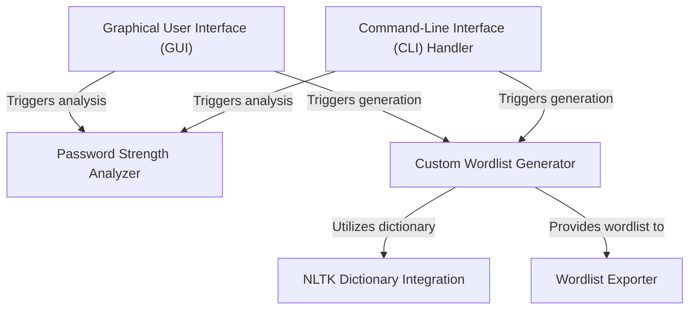

# Tutorial: Password_strength-analyzer_project

This project is a **Password Strength Analyzer** that helps users understand how secure their passwords are by checking them and providing helpful *feedback*. It also includes a tool to *generate* customized lists of potential passwords based on personal information, which can then be *saved* to a file for various security testing purposes. The application offers both an *easy-to-use graphical interface* and a powerful *command-line interface* for flexibility.

## Visual Overview

## Chapters

1. [Graphical User Interface (GUI)
](01_graphical_user_interface__gui__.md)
2. [Command-Line Interface (CLI) Handler
](02_command_line_interface__cli__handler_.md)
3. [Password Strength Analyzer
](03_password_strength_analyzer_.md)
4. [Custom Wordlist Generator
](04_custom_wordlist_generator_.md)
5. [NLTK Dictionary Integration
](05_nltk_dictionary_integration_.md)
6. [Wordlist Exporter
](06_wordlist_exporter_.md)

---

Generated by [AI Codebase Knowledge Builder](https://github.com/The-Pocket/Tutorial-Codebase-Knowledge).
